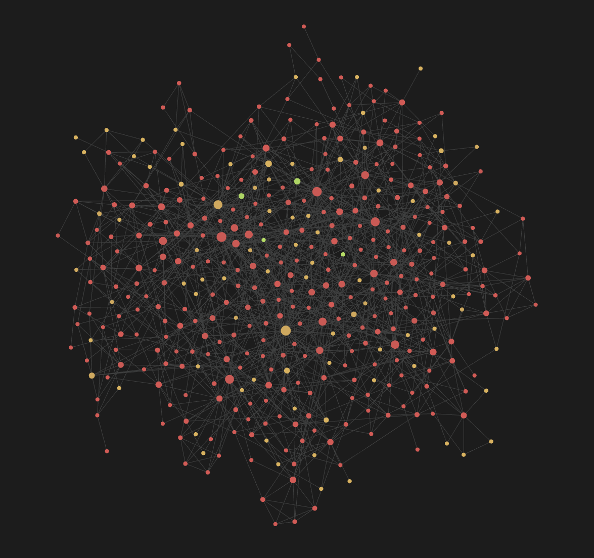
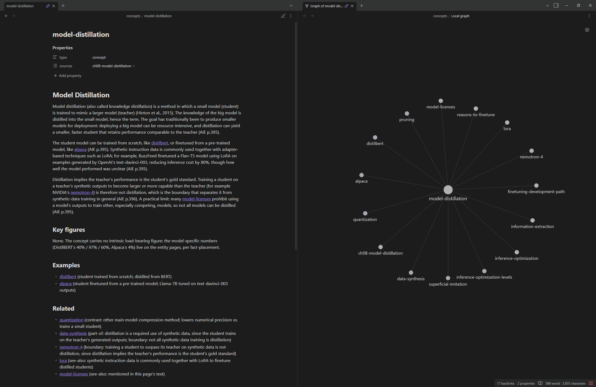

# llm-wiki

An LLM-built wiki of Chip Huyen's *AI Engineering*, measured head-to-head against a RAG system over the same book.

Following Andrej Karpathy's LLM-wiki pattern, an ingest agent compiles the book into 418 interlinked markdown pages, and questions are answered from those pages instead of from the raw text. The point of the project is the measurement: same corpus, same 20 questions and same LLM judge as an existing RAG baseline ([rag-book](https://github.com/phtviet/rag-book)), so the comparison changes only what gets retrieved.

**Full write-up, including method, findings and limitations: [WRITEUP.md](WRITEUP.md)**

## Results

| System | Context vs RAG | Correct / partial / wrong (of 20) |
|---|---|---|
| RAG baseline | 1.0x | 16 / 4 / 0 |
| Wiki, 6 pages, no link-following | 1.1x | 18 / 1 / 1 and 19 / 1 / 0 (two runs) |
| **Wiki, 6 pages + BM25 (final)** | **1.7x** | **19 / 1 / 0 and 20 / 0 / 0 (two runs)** |

- The wiki answered more questions correctly than RAG in all 7 runs, at comparable context.
- Its main failure was a **lossy index**: a fact present in a page the router couldn't see from the index summaries. BM25 over page bodies fixed it.
- **Link traversal** added no measurable benefit on a single book.
- **Caveats:** wiki answers used Claude Sonnet 5 and RAG answers Claude Sonnet 4.5, so part of the margin may come from the model. Scoring is by an LLM judge that agreed with my hand scores on 15 of 20 questions in an independent check, against reference answers partly drafted from the RAG system's output. The write-up covers all three.



*The wiki in Obsidian's graph view: one node per page, coloured by type (red: concepts, yellow: entities, green: syntheses). Source pages and the index are hidden. Larger nodes have more links.*

## How it works

```
book PDF ──► segment.py ──► raw/ (166 sections, cut at the book's own headings)
                                │
                                ▼
                 ingest.py (LLM, governed by SCHEMA.md)
                                │
                                ▼
          wiki/ (concept, entity, synthesis and source pages + index.md)
                                │
               link_pass_a.py (mechanical links)  ·  lint.py (checks)
                                │
                                ▼
 query.py:  question ──► LLM router reads index.md ──┐
                     └─► BM25 over page bodies ──────┴─► union of pages ──► LLM answer with (AIE p.NNN) citations
```

- **Ingest** reads one section at a time and writes pages with a definition, verbatim key figures, typed links to related pages and page-level citations. The rules it follows are in [SCHEMA.md](SCHEMA.md).
- **Query** routes with an LLM over the index, optionally adds BM25 results and one hop of Related links, then answers from the selected pages only.
- **Build-blind:** the ingest agent never saw the evaluation questions; `eval_set.py` was committed after the wiki was frozen (tag `wiki-frozen`).
- **Frozen:** querying never modifies the wiki.

## Repository layout

```
SCHEMA.md            rules the ingest agent follows (page types, entity/concept bars, citations, link types)
segment.py           cuts the extracted book text into sections at its own subsection headings
extract.py           PDF text extraction, reused unchanged from the RAG baseline for corpus parity
ingest.py            ingests one section into wiki pages
batch_ingest.py      ingests every section not yet in wiki/log.md (resumable)
link_pass_a.py       adds links where a page names another page without linking it
lint.py              broken links, orphans, index drift, link-type checks
query.py             answers one question from the wiki
run_eval.py          runs the 20 evaluation questions, writing a run file the judge can score
eval_set.py          the 20 questions and reference answers (copy of the RAG baseline's set)
exemplars/           three hand-written pages used as style examples during ingest
wiki/                the generated wiki (418 pages, plus source pages, index.md, log.md)
eval/runs/           every evaluation run, with retrieved pages and context size per answer
eval/scored/         judge verdicts and rationales for each run, including the RAG re-scores
```

`raw/` and the book PDF are not included: the book is copyrighted. The wiki pages are derived summaries with page citations.

## Reproducing

**Requirements:** Python 3.12, [uv](https://docs.astral.sh/uv/), an Anthropic API key, your own copy of the book PDF, and the [rag-book](https://github.com/phtviet/rag-book) repository cloned alongside this one (its judge scores the runs).

```bash
uv sync
echo "ANTHROPIC_API_KEY=sk-ant-..." > .env
```

**1. Segment the book.** Place the PDF at the repo root as `AI_Engineering.pdf`, then:

```bash
uv run segment.py          # writes raw/ai-engineering/*.txt
```

**2. Build the wiki.** Resumable; already-ingested sections are skipped. A full build is 166 API calls, roughly $15 with Sonnet.

```bash
uv run batch_ingest.py --chapter 1   # optional: one chapter first, to check output
uv run batch_ingest.py               # everything remaining
uv run link_pass_a.py
uv run lint.py --summary
```

**3. Ask a question** with the final configuration:

```bash
uv run query.py "What is model distillation?" --max-pages 6 --no-hop --bm25
```

**4. Run the evaluation:**

```bash
uv run run_eval.py --max-pages 6 --no-hop --bm25 --out eval/runs/my_run.md
```

`query.py` and `run_eval.py` default to link-following on and BM25 off, matching the earlier experimental conditions; pass the flags above for the final configuration. `WIKI_MODEL` overrides the model (default `claude-sonnet-5`).

**5. Score it** with the RAG baseline's judge, in that repository's own environment (its pinned SDK runs the judge at temperature 0):

```bash
cd ../rag-book
# activate rag-book's virtual environment, then:
python score_run.py ../llm-wiki/eval/runs/my_run.md
```

The scored file is written next to the run file.

## Browsing the wiki

`wiki/` is plain markdown with `[[wikilinks]]`, so it opens directly as an [Obsidian](https://obsidian.md) vault: links become clickable and graph view shows the full network of pages.



*A concept page (left) and its local link graph (right). A hand-written version of this page served as the ingest agent's style exemplar; the page shown is the agent's own regeneration of it.*

Opening the vault is read-only in spirit: the wiki is frozen at the evaluated state, so avoid editing pages or clicking links to pages that don't exist yet (Obsidian creates them). Setting **Default view for new tabs** to **Reading view** prevents accidental edits.
